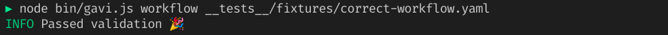
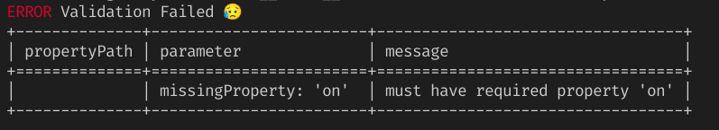

<p align="center"></p>

<p align="center">   </p>

## What's gavi

**gavi** is **G**itHub **A**ctions workflow and action metadata (= action.yaml) **v**al**i**dator.  
Validate the syntax using the following JSON schema:
- https://json.schemastore.org/github-workflow
- https://json.schemastore.org/github-action

## Usage

```bash
Usage: gavi <command> [options]

Commands:
  gavi action <filename>    Validate GitHub Actions metadata file
  gavi workflow <filename>  Validate GitHub Actions workflow file

Options:
  -f, --format    The output format is json or table if validation error is
                  found   [string] [choices: "json", "table"] [default: "table"]
  -l, --logLevel  Logging level
          [string] [choices: "DEBUG", "INFO", "WARN", "ERROR"] [default: "INFO"]
  -s, --silent    Suppress logging message            [boolean] [default: false]
      --version   Show version number                                  [boolean]
      --help      Show help                                            [boolean]
```

## Example

### 1. Pass validation

```bash
gavi workflow __tests__/fixtures/correct-workflow.yaml
```




### 2. Fail validation

```bash
workflow __tests__/fixtures/incorrect-workflow.yaml
```


